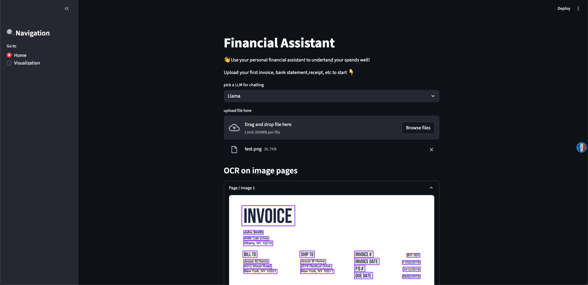
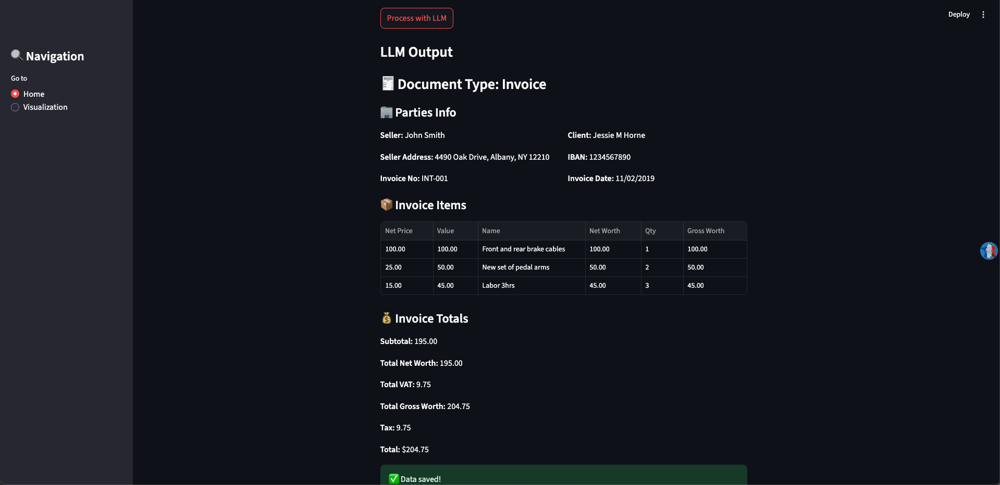

# Invoice & Receipt Analyzer
## Description
A smart financial management tool that processes multi-format inputs (PDF, CSV, TXT, PNG, JPEG) to extract invoice fields using OCR and LLM models and display visualizations for the finaicial analyze.



## Features

- Multi-Format Input: Supports PDF, CSV, TXT, PNG, and JPEG files.

- Field Extraction:

- - EasyOCR: Detected area annonated box
- - Qwen2.5: Fine tuned on Receipt&Invoice Dataset
- - Llama4: 
- - Gemini Flask

- Visualization: Generates financial trends and distributions using Plotly.


## Tech Stack

- OCR: EasyOCR

- LLM: Gemini, Llama, Qwen

- PDF Processing: PyPDF2, pdf2image

- Frontend: Streamlit

- Visualization: Pandas, Plotly


## Run

### Local Install

```zsh
cd FIN-ANALYSER
uv sync
./run.sh
```

### Docker Install
```zsh
docker build -t fin-analyser . 
docker run -e GROQ_API_KEY={} -e GEMINI_API_KEY={} -p 8501:8501 fin-analyser
```

